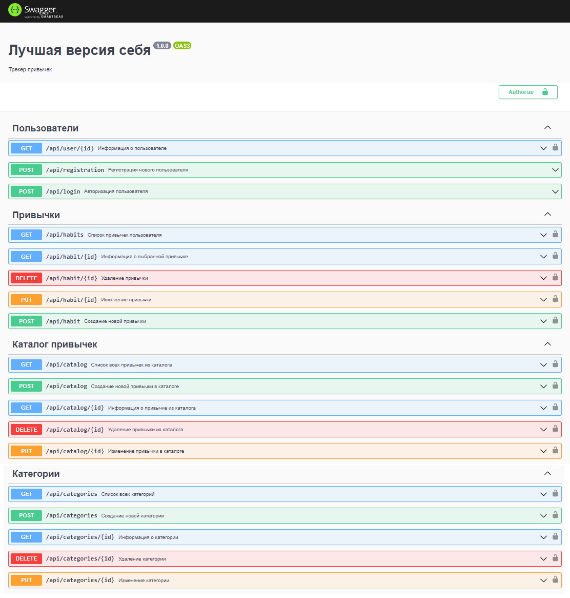

# Трекер привычек "Лучшая версия себя"

Backend сервиса использует Nestjs/MongoDB.
Трекер привычек — это инструмент, который помогает формировать полезные привычки.

Реализованы:
- Регистрация и авторизация
- Каталог привычек с CRUD-endpoints
- Категории привычек с CRUD-endpoints
- Привычки пользователя с CRUD-endpoints

Frontend здесь https://github.com/darkavengersmr/HabitsTrackerUI

